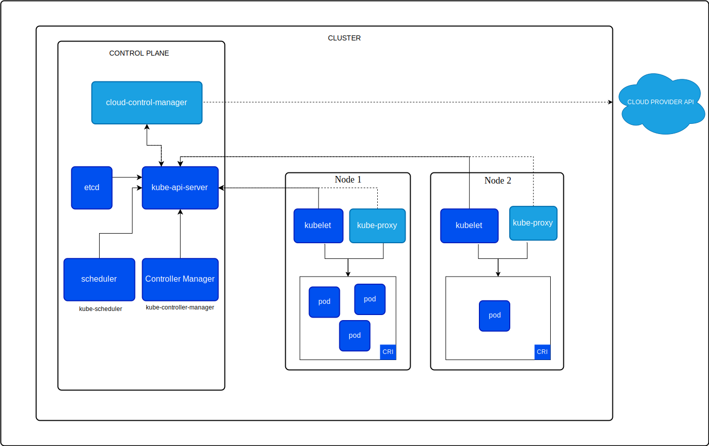

### CONTAINERS : 

Containers are the lightweight machine or OS images which carries our application within itself . It plays crucial role in managing and provisioning the server infrastructure . 

One of the major container tool  docker , which helps to containerize our application and provides separate runtime environment like docker daemon is a background process to run our containers which manages container volumes , inter-domain network and storing our container images. 

> [!NOTE]
> Docker images specifically include the application code and dependencies, making them more efficient than full OS images typically associated with virtual machines.

### CONTAINER ORCHESTRATION : 

containers are being unmanaged by docker which leaves a threat for application to be down at any cost . So over come this problem we use container orchestration tools like kubernetes to manage our application. 

Basically kubernetes is organized by small components to manage and auto scale our application using containers which makes it to be one of major component of modern time .
### ECS (ELASTIC CONTAINER SERVICE) : 

**AWS Elastic Container Service (ECS)** is Amazon's fully managed container orchestration service. It simplifies container deployment and management on AWS infrastructure, allowing you to focus on your application rather than the underlying infrastructure.

We can use all AWS services with in using ECS which makes more efficient to handle or container orchestration with AWS .

It dosn't helpful in managing orchestration outside AWS which makes it difficult to handle container orchestration on other cloud platforms and with on-premisis servers.

### EKS(Elastic Kubernetes Service): 
EKS is the general kubernetes in AWS which follows traditional kubernetes architecture to manage clusters .

**KUBERNETES ARCHITECTURE** :
Basically kubernetes can be divided into two main components 
- Master node
- Worker nodes

Yet to be updated
