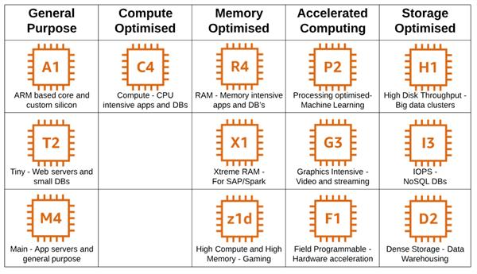

### ELASTIC COMPUTE CLOUD (EC2): 

EC2 is the major compute service offered by AWS . It has wide range of compute services based on CPU , memory , GPU and general purpose instances . User can scale their EC2 vm's without any delay or stopping of their service . 

EC2 instances are directly attached with EBS(elastic block storage) for their root file system , which provides higher iops and low-latency . 

#### Reservation types for instances : 

There are two types of compute instance types offered by AWS . 
- On-Demand Instances  
	**as pay as you use model** : we only pay for the amount of time that instance in on or running.
- reserved instances
	**Long-Term Commitment** : we will reserved for long time for our production need as for months or years and they also provide certain discount for these instances .

*Reserved Instance pricing is not based on use. The price is fixed and locked in. On-Demand Instance pricing is based on use—projected for an equivalent three-year period.*

|                  | **On-Demand**                                                                 | **Reserved**                                                             |
| ---------------- | ----------------------------------------------------------------------------- | ------------------------------------------------------------------------ |
| Cost             | Charged per time unit of use                                                  | Fixed for one-year or three-year period                                  |
| Cost variability | Cost fluctuates with usage                                                    | Cost is fixed irrespective of usage                                      |
| Availability     | Guaranteed only with On-Demand Capacity reservation                           | Always guaranteed                                                        |
| On-selling       | Optional; Switch off if you no longer require it and no further charges apply | You can buy and sell Reserved Instances on the AWS Instances Marketplace |

---
### EC2 Instance family types : 

As mentioned above there are huge family of compute instances under EC2 compute instances some of them are ,
#### General Purpose Instances: 
Under these instance family we will get an all around stable performance can be ideal for running web servers .
- T family and M family instances . 
#### Compute Optimized Instances: 
compute instance family provides higher compute performance can be ideal for high performance oriented tasks . 
- C family instances.

#### Memory Optimized : 
These instances are basically ideal for memory dependent databases and other process dependent on high memory usage tasks . 
- R family instances . 

#### Accelerated Computing : 
These are instances dependent on most of GPU oriented tasks like Machine learning model training and high parallel processing tasks it will be much better suited . 
- p and G family instances .

---
### Compute Instances over other services like paas and saas : 

### AWS Lambda : 

AWS lambda is the server-less compute service which can be managed by AWS itself and enable use different high level programming languages to interact with AWS lambda like
- python
- java
- node-js
- ruby
- c#
- Go

AWS Lambda is ideal for event-driven applications and allows developers to focus solely on code without worrying about servers.

They charge for number of request in-terms of time and duration of the function . 
> [!NOTE]
>- **Number of Requests**: You are charged for the total number of requests processed by your Lambda functions.
>- **Duration**: The duration is calculated based on the time your code takes to execute, measured in milliseconds.

### ELASTIC BEAN STALK : 

It helps developers by managing all the infrastructue provisioning and management only thing we have to manage is our source code of our application . 

---

