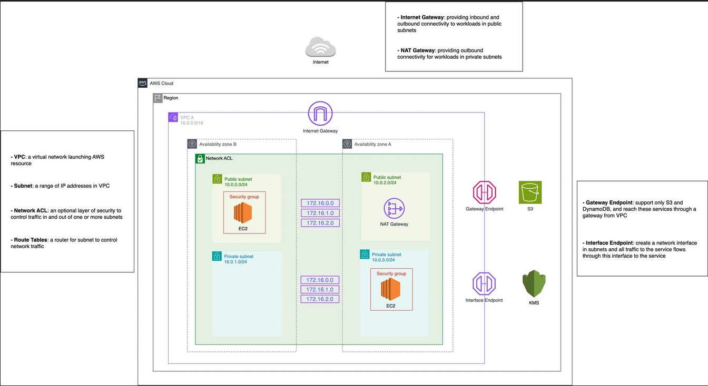

### VPC (Virtual Private Cloud):

- VPC is a network service helps in managing network traffic across our cloud infrastructure .
- It helps in making secure way of managing our network traffic with components like public and private subnets , route table , igw , NATgw , ACL , security groups .

### VPC : 

VPC makes the isolated network from the cloud and makes every services to communicate locally and over the internet through separate features .

#### subnets : 

subnets named public and private subnets can be created for a single vpc.
- private subnets can not accessed from internet and and compute services or other services can access their resources from internet through NAT gateway

	`no inbound access only outbound access when using NAT gateway`

- public subnets can be accessed through internet by configuring igw (INTERNET GATEWAY).

	`inbound and outbound access through igw`

> [!NOTE]
> INTERNET GATEWAY (igw):
> 
Allows two-way traffic between instances and the internet (both inbound and outbound).

> [!NOTE]
> NAT GATEWAY:
> 
 Only allows outbound traffic from private subnets to the internet (no inbound traffic).

#### ROUTE TABLE : 

- Route tables can direct traffic to the internet through an Internet Gateway, allowing public instances to send and receive traffic.

- Route tables can route traffic to your on-premises network via a VPN or Direct Connect, facilitating hybrid cloud architectures.

---

#### SECURITY IN NETWORKING : 

 In VPC there are two layers of security is provided,

- security groups : 

	**USAGE** : 
	they acts are virtual firewalls , Security groups are applied to an individual resource, like an EC2 instance, elastic network interface, or a database.They are stateful which specifies once an outbound access is configures inbound will always allowed .
	
	**ROLE SPECIFIC**:
		It can be applied to any compute or storage instances.
		By default all inbound access are denied and all out bound access are allowed

> [!NOTE]
> In a **stateful** system, if a connection is allowed in one direction (e.g., incoming traffic), the response traffic (e.g., outgoing traffic for that connection) is automatically allowed without needing an explicit rule. This makes managing rules easier, as you only need to define one side of the communication.		

- NETWORK ACCESS CONTROL LIST (NACL) : 

	**USAGE** :
	It gives security provisioning at subnet layer  which refers that it gives protection to entire subnet . They are stateless

	By default, NACLs allow all inbound and outbound traffic unless explicitly configured otherwise.
	
	**RULES PRIORITY**:
	NACL rules are evaluated in order, starting from the lowest numbered rule. The first rule that matches the traffic type is applied.

> [!NOTE]
> In a **stateless** system, both inbound and outbound traffic rules need to be explicitly defined. It does not automatically allow response traffic, so you must define separate rules for both directions of communication.

---

### VPC Peering : 

vpc peering enables us to connect two vpc on the separate regions such as 

*Asia Pacific (Mumbai) - `ap-south-1`* 
*Asia Pacific (Hyderabad) - `ap-south-2`* 

 If I want to connect or extend my network over two vpc regions I can provision my vpc peering to extend my infrastructure.

#### Connecting on-premisis server with AWS: 

In order to have connection with on-premsis server with aws to establish hybrid cloud **AWS Direct Connect** service is used for  a private connection between your infrastructure and AWS through a dedicated physical network link. This connection bypasses the public internet, providing more consistent and predictable performance.

--- 
